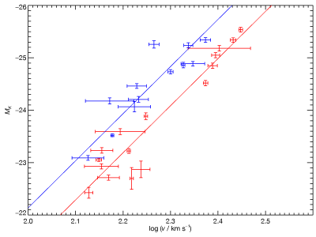

`MPFITEXY`: Straight line fitting with IDL and `MPFIT`
========

<code>MPFITEXY</code> is a wrapper around Craig Markwardt&#8217;s <a
href="http://purl.com/net/mpfit"><code>MPFIT</code></a>. It finds the
best-fitting straight line through data with errors in both coordinates. In the
absence of intrinsic scatter it minimizes the same figure of merit at the
ASTROIDL <a
href="http://idlastro.gsfc.nasa.gov/ftp/pro/math/fitexy.pro"><code>FITEXY</code></a>
routine, which is itself an implementation of the well known Numerical Recipes
approach to fitting a straight line to data with errors in both
coordinates.

<code>MPFITEXY</code> adds a number of extra features not supported by
<code>FITEXY</code>:

<ul>

<li>
User-specified intrinsic scatter, i.e. the weighting for each data
point is of the form (&sigma;<em>x</em>2 +
&beta;2&sigma;<em>y</em>2 +
&sigma;int2). Intrinsic scatter is physically
significant and statistically necessary in
situations where, even with perfect data (i.e. no observational
errors), the data is scattered about the model. This is the &#8220;Nukers&#8217;
Estimate&#8221; described in <a href="http://cdsads.u-strasbg.fr/abs/2002ApJ...574..740T">Tremaine et al.
(2002)</a>.
</li>

<li>
&sigma;int is automatically adjusted to ensure
&chi;2/(degrees or freedom) &asymp; 1 (if the optional
<code>/reduce</code> keyword is enabled). This is done using the
iterative procedure described in Section 3.2.1 of <a href="http://cdsads.u-strasbg.fr/abs/2006MNRAS.373.1125B">Bedregal,
Aragón-Salamanca &amp; Merrifield
(2006)</a>.
</li>

<li>
The inverse relationship is optionally fitted, i.e. <em>y</em> is regressed
onto <em>x</em>, if the <code>/inv</code> keyword is enabled. You can of
course do this in <code>FITEXY</code> by swapping round the
variables in the procedure call, but <code>MPFITEXY</code> handles
the inversion of the results and the propagation of errors. Inverse
fitting is therefore completely transparent to the user. See, e.g.
<a href="http://cdsads.u-strasbg.fr/abs/1994ApJS...92....1W">Willick (1994)</a>
for the background to why you might want to fit the inverse
relationship.
</li>

<li>
You can fix the slope <em>or</em> the intercept using the
<code>/fixslope</code> and <code>/fixint</code> keywords.
</li>

</ul>

Installation and use
====================

 1. Download and install [`MPFIT`](http://purl.com/net/mpfit)
 
 2. Place the files `mpfitexy.pro` and/or `mpfitexy2.pro` in your IDL path 
 
Calling sequence, usage, etc. is described in each file. These routines have
been tested with a relatively narrow set of data, so they may contain bugs or
be missing crucial features. Please report problems via Github.

Warning
=======

This code merely minimizes a figure of merit, i.e. it solves an engineering
problem. This figure of merit happens to be the maximum likelihood estimate of
a linear model. This model assumes that data follows a linear model with
normally distributed observational noise and intrinsic scatter. You should
consider whether this figure of merit is an justified objective function that
measures the quality of a model in your scientific or statistical context. For
more on this, please read <a
href="http://adsabs.harvard.edu/abs/2010arXiv1008.4686H">Hogg, Bovy &amp; Lang
(2010)</a>.

Acknowledgment 
==============

The features of the code are discussed, and relevant literature cited, in
Section 4 of [Williams, Bureau & Cappellari
(2010)](http://adsabs.harvard.edu/abs/2010MNRAS.409.1330W). In the
[interests of
reproducibility](http://cameronneylon.net/presentations/best-practice-in-science-and-coding-holding-up-a-mirror/),
you should either cite that publication (which I would prefer) or refer to the
permanent URL at which MPFITEXY can always be found:
[http://purl.org/mike/mpfitexy](http://purl.org/mike/mpfitexy). MPFITEXY is
dependent on the MPFIT package, which you must separately acknowledge by citing
[Markwardt (2009)](http://adsabs.harvard.edu/abs/2009ASPC..411..251M). So, you
could cite MPFITEXY like this:

> We fit a linear relationship to the data using the MPFITEXY routine
> (Williams, Bureau & Cappellari 2010). The MPFITEXY routine depends on the
> MPFIT package (Markwardt 2009).
  
or like this 

> We fit a linear relationship to the data using the MPFITEXY
> routine.1 The MPFITEXY routine depends on the MPFIT package
> (Markwardt 2009).
>
> 1 http://purl.org/mike/mpfitexy

`MPFITEXY2`
==========

<code>MPFITEXY2</code> simultaneously fits straight lines to two sets of
data with a shared slope. It is useful for measuring the offset between the
straight line fits to two samples, while simultaneously using as much
information as possible to constrain their shared slope and zero-point.

The data can have errors in the <em>x</em> and <em>y</em> directions, and
intrinsic scatter. <code>MPFITEXY2</code> supports all the convenient features
supported by <code>MPFITEXY</code> (optimization of &sigma;int,
inverse relationship fitting, fixed slope or intercept &#8211; see above).

<code>MPFITEXY2</code> is an implementation of the minimization problem
described in Section 4 of <a
href="http://adsabs.harvard.edu/abs/2010MNRAS.409.1330W">Williams, Bureau &amp;
Cappellari (2010)</a>. The details of your data will affect whether the
assumptions we make are justified. I urge you to read that short section before
depending on the results of <code>MPFITEXY2</code>.

